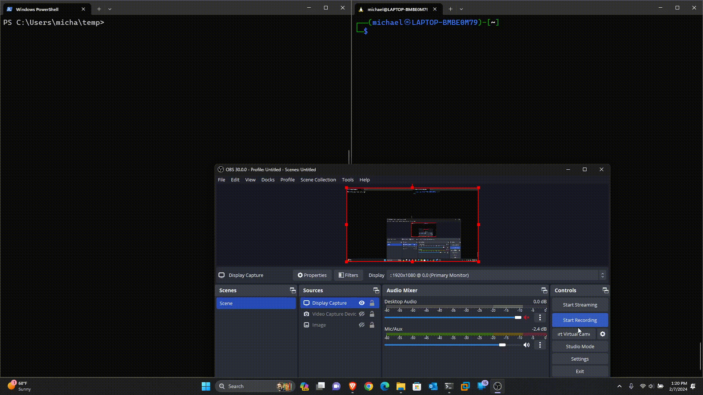

# Honeytask: A Responder Detection Tool

## Overview

This PowerShell script is designed to detect the use of Responder, a network penetration testing tool, in a network environment. It periodically sends a bogus LLMNR (Link-Local Multicast Name Resolution) request and monitors for any responses indicative of Responder usage. Upon detection, it notifies the user with a desktop notification and prints details to the console.

## Features

- **Scan Interval:** The script operates with a specified scan interval (default: 30 seconds) to continuously monitor the network.
- **Bogus LLMNR Request:** Utilizes a randomized LLMNR request to attract potential responses from Responder.
- **Desktop Notification:** Sends a desktop notification using the BurntToast module when Responder activity is detected.
- **Console Output:** Prints information about the detected Responder activity to the console with colored text.

## Usage

1. **Requirements:**
   - PowerShell (Version 5.1 or later)
   - [BurntToast](https://www.powershellgallery.com/packages/BurntToast) module. Install it using `Install-Module BurntToast -Scope CurrentUser`.

2. **Configuration:**
   - Adjust the `$SCAN_INTERVAL` variable to set the desired scan interval in seconds.
   - Optionally, change the `$REQUEST` variable for a different LLMNR request.

3. **Execution:**
   - Run the script using PowerShell: `.\ResponderDetection.ps1`

4. **Detection:**
   - The script listens for responses to the LLMNR request, and if Responder activity is detected, it triggers desktop notifications and prints details to the console.

## Demonstration

## Disclaimer

This tool is intended for educational and testing purposes only. Ensure that you have the appropriate authorization before using it in any network environment.

## License

This script is released under the [MIT License](LICENSE). Feel free to modify and distribute according to the license terms.

**Happy detecting!**
